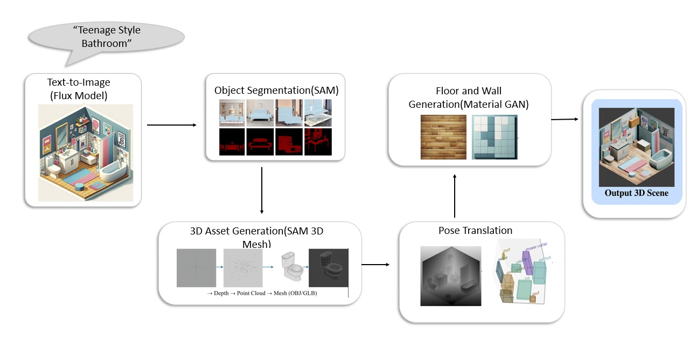

# context-aware-text-to-3d-scene-generation
AI-based pipeline for generating spatially coherent 3D indoor environments from natural language using FLUX, SAM, SAM3D and MaterialGAN.
# Context-Aware Text-to-3D Scene Generation for Indoor Environments

An AI-based pipeline for generating spatially coherent 3D indoor environments from natural language descriptions.

## 📌 Overview

This project presents a multi-stage pipeline that converts a text description of an indoor environment into a structured 3D scene.

The pipeline combines text-to-image generation, object segmentation, 3D object reconstruction, pose estimation, material generation, and final scene composition.

## 🔄 System Pipeline

The proposed system follows a six-stage pipeline that transforms a natural
language description into a complete 3D indoor environment.



### Pipeline Stages

1. **Text-to-Image Generation** — FLUX generates the initial 2D scene.
2. **Object Segmentation** — SAM extracts individual object masks.
3. **3D Asset Generation** — SAM3D reconstructs the segmented objects into 3D assets.
4. **Pose Translation** — The generated objects are positioned and oriented in 3D space.
5. **Material Generation** — MaterialGAN generates materials for the floor and walls.
6. **Final Scene Composition** — The objects, poses and materials are combined into the final 3D scene.
## 📁 Repository Structure

```text
context-aware-text-to-3d-scene-generation/
│
├── README.md
│
├── Results/
│   ├── 01.Text_to_Image/
│   ├── 02.Object_Segmentation/
│   ├── 03.Sam_Output/
│   ├── 04.Pose_Estimation/
│   ├── 05.Material_Generation/
│   └── 06.Final_Results/
│
└── src/
