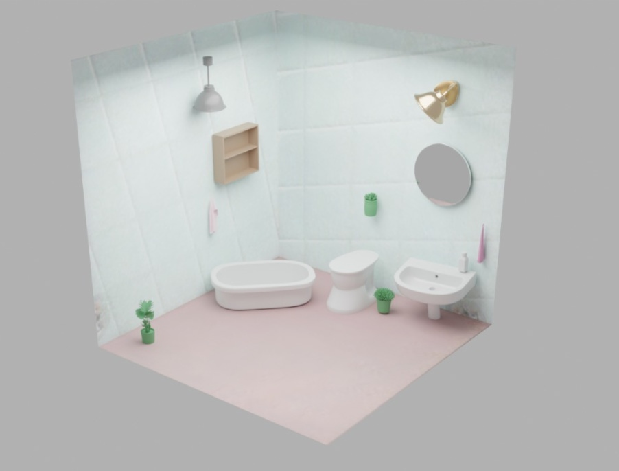
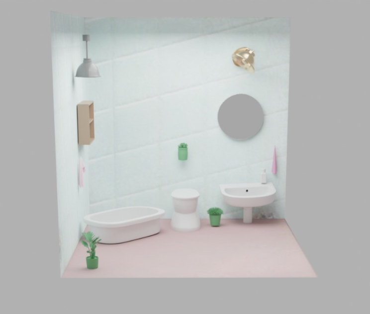
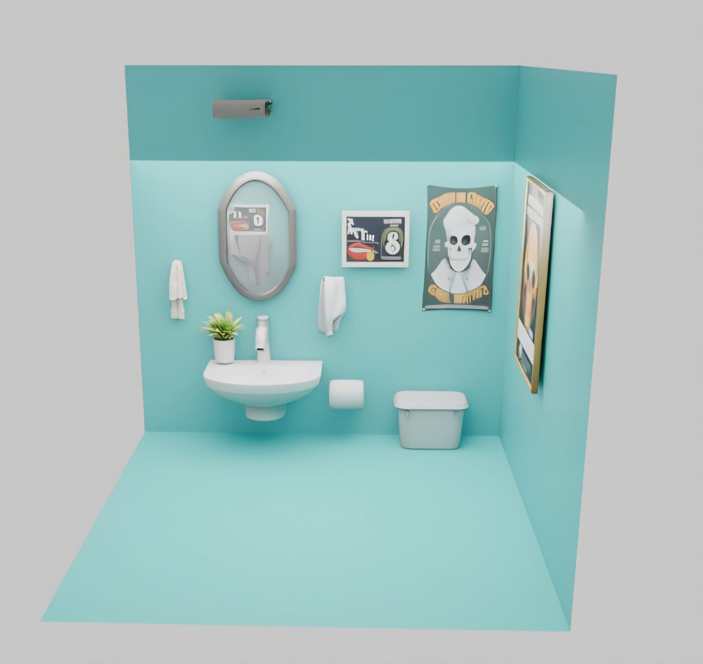
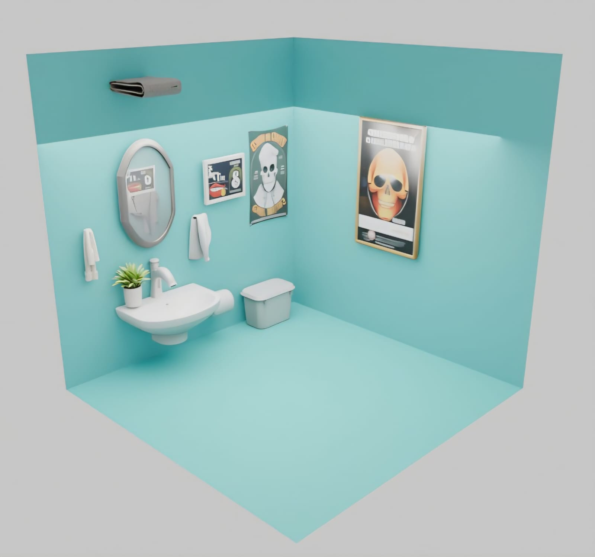

# Context-Aware Text-to-3D Scene Generation for Indoor Environments

An pipeline for generating spatially coherent 3D indoor environments from natural language descriptions.

## 📌 Overview

This project presents a multi-stage pipeline that converts a text description of an indoor environment into a structured 3D scene.

The pipeline combines text-to-image generation, object segmentation, 3D object reconstruction, pose estimation, material generation, and final scene composition.

## 🔄 System Pipeline

The proposed system follows a six-stage pipeline that transforms a natural
language description into a complete 3D indoor environment.


### Pipeline Stages

1. **Text-to-Image Generation** — FLUX generates the initial 2D scene.
2. **Object Segmentation** — SAM extracts individual object masks.
3. **3D Asset Generation** — SAM3D reconstructs the segmented objects into 3D assets.
4. **Pose Translation** — The generated objects are positioned and oriented in 3D space.
5. **Material Generation** — MaterialGAN generates materials for the floor and walls.
6. **Final Scene Composition** — The objects, poses and materials are combined into the final 3D scene.


## 🛠️ Technologies Used

- Python
- FLUX
- Segment Anything Model (SAM)
- SAM 3D Objects
- Any6D / 6D Pose Estimation
- MaterialGAN
- Unity
- 3D scene processing
- GLB / 3D assets

## 🔗 External Repositories & Resources

This project uses and references publicly available research implementations and tools.

### ArtiScene
Used as a reference for language-driven 3D scene generation.

https://github.com/NVLabs/ArtiScene

### Segment Anything (SAM)
Used for object segmentation and mask generation.

https://github.com/facebookresearch/segment-anything

### SAM 3D Objects
Used for 3D object reconstruction from image and mask inputs.

https://github.com/facebookresearch/sam-3d-objects

### Any6D
Used/referenced for 6D object pose estimation.

https://github.com/taeyeopl/Any6D

### Unity
Used for 3D scene visualization and integration.

https://unity.com/


## 📁 Repository Structure

```text
context-aware-text-to-3d-scene-generation/
│
├── README.md
│
├── Results/
│   ├── 01.Text_to_Image/
│   ├── 02.Object_Segmentation/
│   ├── 03.Sam_Output/
│   ├── 04.Pose_Estimation/
│   ├── 05.Material_Generation/
│   └── 06.Final_Results/
│
└── src/

##🖼️ Final 3D Scene Results

The final stage combines the reconstructed 3D objects, estimated poses,
and generated materials to produce the complete indoor 3D scene.

### Final Scene 1



### Final Scene 2



### Final Scene 3



### Final Scene 4


